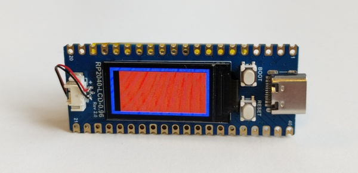

# PicoDoro

[Pomodoro](https://en.wikipedia.org/wiki/Pomodoro_Technique) timer on [RP2040-LCD-0.96](https://www.waveshare.com/wiki/RP2040-LCD-0.96)

Code is done for [Micropython v1.20](https://docs.micropython.org/en/v1.20.0/rp2/quickref.html)

## User manual

- Use `Reset` button to start timer
- Time is hardcoded to 25min / 5min in [main.py](src/main.py)
